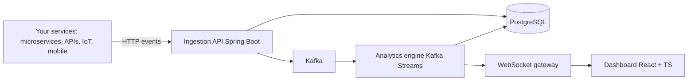

<div align="center">
  <picture>
    <!-- Dark Mode Image -->
    <source media="(prefers-color-scheme: dark)" srcset="https://github.com/user-attachments/assets/99d3120a-4f56-4898-ba51-d6b5c0f14d02">
    <!-- Light Mode Image -->
    <source media="(prefers-color-scheme: light)" srcset="https://github.com/user-attachments/assets/addfaf5d-5bbe-45b2-a929-0ca7a9d48fd6">
    <!-- Fallback / Default Image (REQUIRED) -->
    
  </picture>
  
  # See it before your users do
</div>


<div align="center">
  <h3>Real-time event analytics and intelligent alerting you can self-host</h3>
  <p>Kafka-powered ingestion, live dashboards, and rule-based alerts for engineers who want control.</p>

  <p>
    <a href="./LICENSE">
      
    </a>
    <a href="#quick-start-docker">
      
    </a>
    <a href="https://kafka.apache.org/">
      
    </a>
    <a href="#contributing">
      
    </a>
    <a href="https://github.com/tusharkhatriofficial/eventara/stargazers">
      
    </a>
  </p>

  <p>
    <a href="https://github.com/tusharkhatriofficial/eventara/issues">Issues</a>
    ·
    <a href="https://github.com/tusharkhatriofficial/eventara/discussions">Discussions</a>
    ·
    <a href="#quick-start-docker">Quick start</a>
    ·
    <a href="#architecture">Architecture</a>
    ·
    <a href="#roadmap">Roadmap</a>
  </p>
  
  
  

</div>

---

## Why Eventara

Eventara is an open-source platform for real-time event monitoring, analytics, and alerting. You stream events from your services, visualize live behavior, detect anomalies, and route alerts to the right place without handing your data to a vendor.

Use Eventara when you want:
- A self-hosted alternative to expensive observability and monitoring tools
- Low-latency insights on product and system events
- A customizable pipeline for analytics plus alerting, built on Kafka

---

## What you can build

Common use cases:
- Detect payment failures and notify on-call instantly
- Monitor signup or checkout rate drops in real time
- Track API error spikes and latency regressions
- Analyze event-type trends live while shipping features
- Stream IoT signals and trigger actions on anomalies

---

## Key capabilities

- Real-time ingestion API for events
- Kafka-backed streaming pipeline
- Live dashboard with WebSocket updates (no refresh)
- Metrics endpoints for system health and throughput
- Extensible roadmap for rule engine and multi-channel alerting

---

## Quick start (Docker)

### Prerequisites
- Docker and Docker Compose
- Git

### Run all services
```bash
git clone https://github.com/tusharkhatriofficial/eventara.git
cd eventara
docker compose up --build -d
docker compose logs -f
```

### Open the UI and services
| Service | URL | Purpose |
|---|---|---|
| Dashboard | http://localhost:5173 | Real-time analytics UI |
| API | http://localhost:8080 | Event ingestion and metrics |
| Kafka UI | http://localhost:8090 | Topics and messages |

---

## Send your first event

```bash
curl -X POST http://localhost:8080/api/v1/events \
  -H "Content-Type: application/json" \
  -d '{
    "eventType": "user.login",
    "source": "auth-service",
    "userId": "test_user_123",
    "severity": "INFO"
  }'
```

Then open the dashboard at http://localhost:5173 and verify updates arrive in real time.

---

## Demo traffic (20-second showcase)

### macOS zsh / Linux bash
```bash
for i in {1..60}; do
  curl -s -X POST http://localhost:8080/api/v1/events \
    -H "Content-Type: application/json" \
    -d '{"eventType":"user.login","source":"auth-service","userId":"user_1","severity":"INFO"}' >/dev/null

  curl -s -X POST http://localhost:8080/api/v1/events \
    -H "Content-Type: application/json" \
    -d '{"eventType":"payment.success","source":"payment-service","userId":"user_2","severity":"INFO"}' >/dev/null

  curl -s -X POST http://localhost:8080/api/v1/events \
    -H "Content-Type: application/json" \
    -d '{"eventType":"order.created","source":"order-service","userId":"user_3","severity":"WARNING"}' >/dev/null

  curl -s -X POST http://localhost:8080/api/v1/events \
    -H "Content-Type: application/json" \
    -d '{"eventType":"payment.failed","source":"payment-service","userId":"user_4","severity":"ERROR"}' >/dev/null

  sleep 0.3
done
```

### Windows PowerShell
```powershell
for ($i = 1; $i -le 60; $i++) {
  curl -s -Method POST -Uri "http://localhost:8080/api/v1/events" `
    -Headers @{ "Content-Type"="application/json" } `
    -Body '{"eventType":"user.login","source":"auth-service","userId":"user_1","severity":"INFO"}' | Out-Null

  curl -s -Method POST -Uri "http://localhost:8080/api/v1/events" `
    -Headers @{ "Content-Type"="application/json" } `
    -Body '{"eventType":"payment.success","source":"payment-service","userId":"user_2","severity":"INFO"}' | Out-Null

  curl -s -Method POST -Uri "http://localhost:8080/api/v1/events" `
    -Headers @{ "Content-Type"="application/json" } `
    -Body '{"eventType":"order.created","source":"order-service","userId":"user_3","severity":"WARNING"}' | Out-Null

  curl -s -Method POST -Uri "http://localhost:8080/api/v1/events" `
    -Headers @{ "Content-Type"="application/json" } `
    -Body '{"eventType":"payment.failed","source":"payment-service","userId":"user_4","severity":"ERROR"}' | Out-Null

  Start-Sleep -Milliseconds 300
}
```

---

## Dashboard

Current pages:
- Overview: key metrics, health, live charts
- Real-time monitoring: live stream and throughput
- Event analytics: event types, patterns, trends
- Source analytics: planned improvements
- Error analysis: planned improvements
- Performance metrics: planned improvements

Data updates live via WebSocket.

---

## Architecture



Design goals:
- Keep ingestion fast and durable using Kafka
- Separate real-time views from storage for scalability
- Make alerting a first-class, pluggable layer

---

## API

### Create event
`POST /api/v1/events`

```json
{
  "eventType": "user.signup",
  "source": "web-app",
  "userId": "user_456",
  "severity": "INFO",
  "tags": {
    "campaign": "summer_sale"
  },
  "metadata": {
    "plan": "premium"
  }
}
```

### Get metrics
`GET /api/v1/metrics`

### Query events
`GET /api/v1/events/type/payment.failed?page=0&size=10`

---

## Tech stack

| Layer | Tech |
|---|---|
| Backend | Spring Boot (Java 21) |
| Messaging | Apache Kafka |
| Storage | PostgreSQL (TimescaleDB planned) |
| Real-time | WebSocket |
| Frontend | React + TypeScript + Vite |
| Styling | Tailwind CSS |
| Charts | Chart.js |
| Streaming analytics | Kafka Streams |
| Deployment | Docker (Kubernetes-ready) |
| Planned | Redis, Prometheus, Grafana, gRPC |

---

## Operations (Docker)

```bash
# Start
docker compose up --build -d

# Logs
docker compose logs -f springboot
docker compose logs -f dashboard
docker compose logs -f kafka

# Status
docker compose ps

# Stop
docker compose down

# Wipe data (DB + Kafka)
docker compose down -v
```

Useful:
```bash
docker exec -it postgres14 psql -U postgres -d eventara
docker exec -it eventara-kafka kafka-topics --bootstrap-server localhost:9092 --list
```

---

## Roadmap

### Phase 1: Foundation ✅
- Architecture and Docker baseline
- Ingestion service and REST API
- Kafka producer/consumer integration
- PostgreSQL storage

### Phase 2: Real-time analytics ✅
- WebSocket streaming
- Metrics service
- React dashboard pages

### Phase 3: Rule engine and alerting 🚧
- Rule definition engine ✅
- Threshold-based alerting 🚧
- Notifications: Email, Slack, Webhook
- Alert acknowledgment workflow

### Phase 4: Advanced features ⏳
- Time-series storage (TimescaleDB)
- Historical analytics and query improvements
- Custom dashboards
- Export: CSV, JSON
- Authentication and authorization

### Phase 5: Production readiness ⏳
- Redis caching
- Horizontal scaling guidance
- Kubernetes manifests
- Prometheus and Grafana
- Production deployment guides

---

## Troubleshooting

### Dashboard stuck on connecting
- Check backend logs: `docker compose logs -f springboot`
- Restart: `docker compose restart springboot dashboard`
- Confirm the API is reachable: `curl http://localhost:8080/api/v1/metrics`

### No events appearing
- List Kafka topics:
  ```bash
  docker exec -it eventara-kafka kafka-topics --bootstrap-server localhost:9092 --list
  ```
- Check consumer logs: `docker compose logs -f springboot`

### Port already in use
Change host ports in `docker-compose.yml` (for example `5174:5173`, `8081:8080`, `5433:5432`).

---

## Contributing

Contributions are welcome from engineers learning Spring Boot, Kafka, React, and DevOps, and from teams who want a self-hosted analytics and alerting platform.

How to contribute:
- Pick an Issue (look for "good first issue")
- Propose features in Discussions
- Improve docs, tests, and examples

### Development setup (local)

Backend:
```bash
mvn spring-boot:run
```

Frontend:
```bash
cd eventara-dashboard
npm install
npm run dev
```

### Pull request workflow
1. Fork the repository
2. Create a branch: `git checkout -b feature/your-feature`
3. Commit: `git commit -m "Add your feature"`
4. Push: `git push origin feature/your-feature`
5. Open a Pull Request

---

## License

Licensed under the Apache License 2.0. See `LICENSE`.

---

## Community

- **Issues:** https://github.com/tusharkhatriofficial/eventara/issues
- **Discussions:** https://github.com/tusharkhatriofficial/eventara/discussions
- **Email:** hello@tusharkhatri.in

---

<div align="center">

### ⭐ Star this repo if you find it useful!

**Built with ❤️ for the developer community**

[](https://github.com/tusharkhatriofficial/eventara)
[](https://github.com/tusharkhatriofficial/eventara)
[](https://github.com/tusharkhatriofficial/eventara)

</div>
